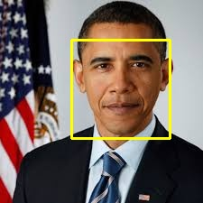
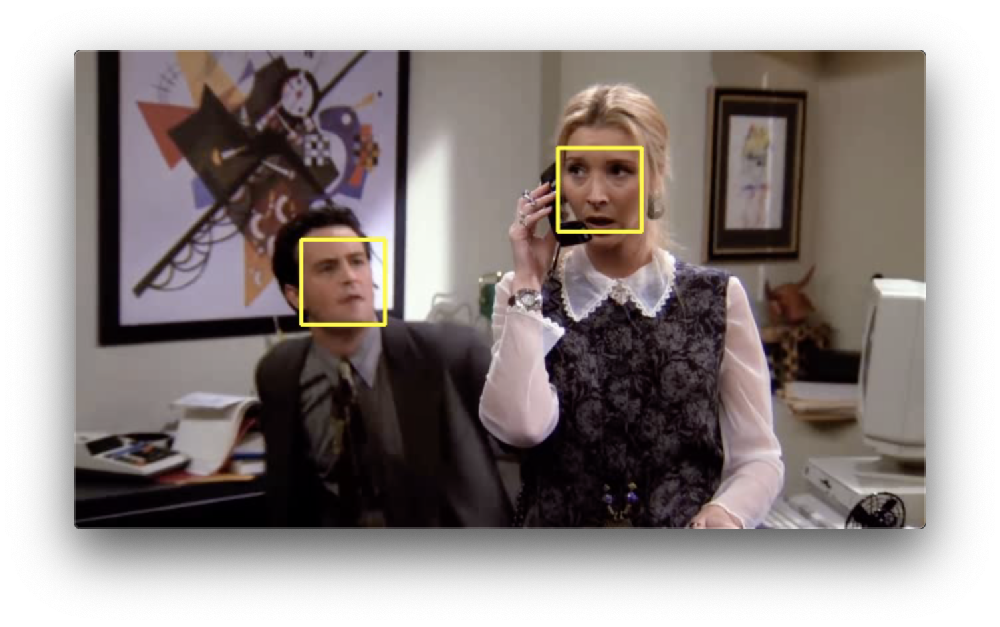

# Face Detection

This project implements the Haarcascades and dlib techniques to detect faces on an image or a video.


## Quick Startup

### Download the video

You can download a video [here](https://drive.google.com/file/d/1nEMI6ejKPkKhRKroFSp-fOHMf9QsBRn1/view?usp=sharing) to test the module.


### Create a Virtual Environment

If you are on MacOS or Linux, type the following command to create a python virtual environment and install the required packages:

```bash
./configure.sh
```

Then, activate the virtual environment:

```bash
source .venv/bin/activate
```

***Nota***:
<br>This project requires `python 3`. You must install it first.


### Run

Under the virtual environment, execute the command:

```bash
python src/main.py --operation 'get' --type 'detect' --method 'dlib' --source './datasets/images/obama.jpg' --destination './datasets/images/out.jpg'
```

You will get:



For extracting the face, execute the command:

```bash
python src/main.py --operation 'get' --type 'extract' --method 'dlib' --source './datasets/images/obama.jpg' --destination './datasets/images/out2.jpg'
```

You will get:


For a video execute the command (you must first download this video with the link above):

```bash
python src/main.py --operation 'get' --type 'detect' --method 'dlib' --source './datasets/videos/testfriends.mp4' --destination './datasets/videos/out.mp4'
```

You will get:




## License

MIT.
